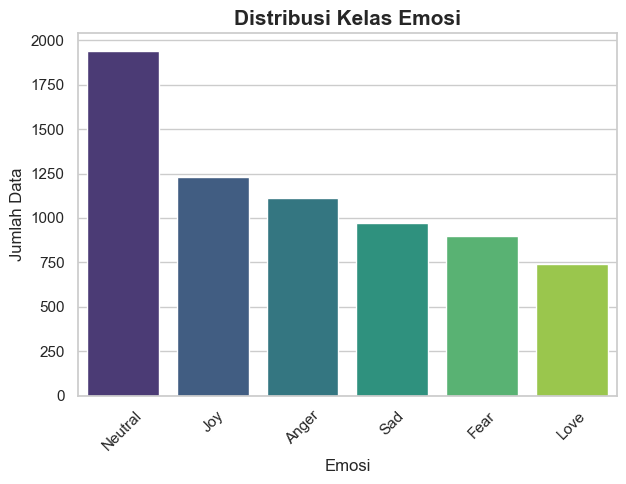
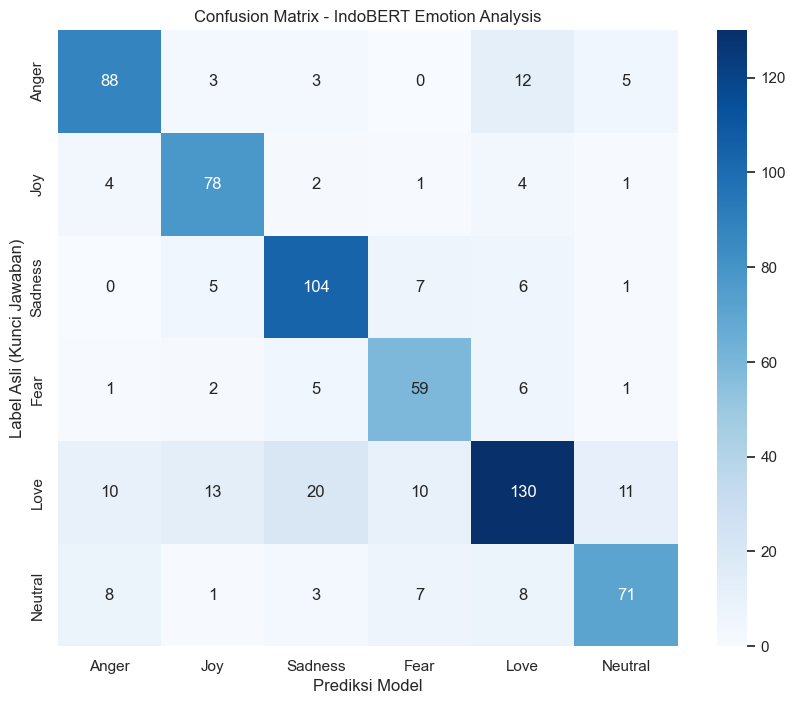
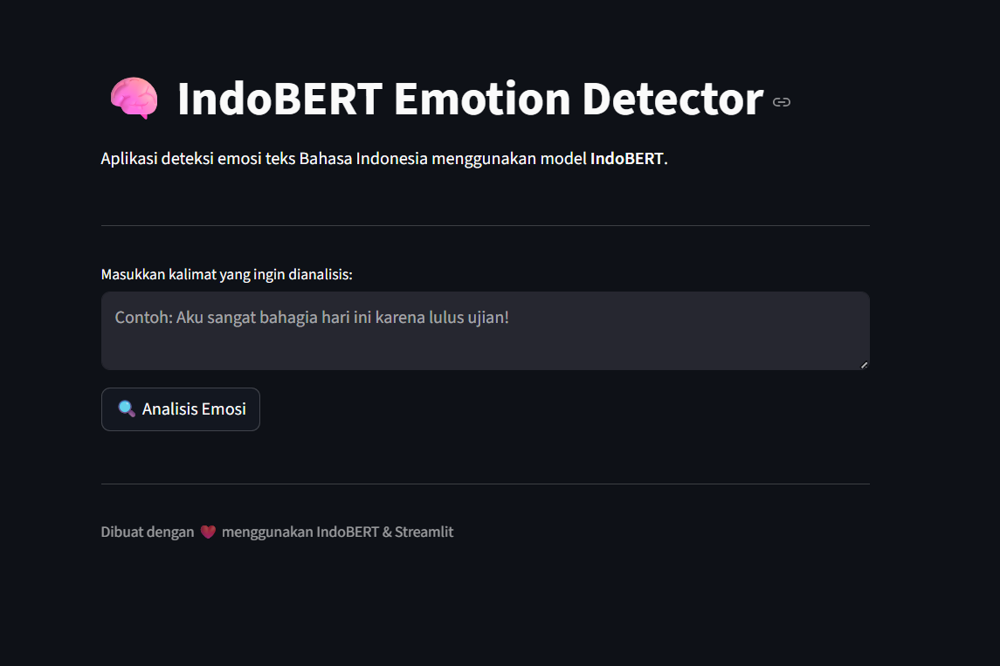

# 🧠 IndoBERT Emotion Detector

> **"Mengupas Emosi Netizen: Mengatasi Ketimpangan Data dan Ambiguitas Bahasa dengan IndoBERT."**

Sebuah proyek **end-to-end Deep Learning** untuk mengklasifikasikan emosi dalam teks **Bahasa Indonesia**, mulai dari *data understanding*, *modeling*, hingga *deployment* berbasis web.

---

## 🚀 Latar Belakang: *The Reality Gap*

Mengapa klasifikasi emosi Bahasa Indonesia itu sulit?  
Proyek ini lahir untuk menjawab dua tantangan nyata di dunia NLP Indonesia:

1. **Bahasa “Alien” (Slang & Noise)**  
   Netizen Indonesia jarang menggunakan bahasa baku. Kata gaul, singkatan *alay*, typo, hingga sarkasme membuat banyak model NLP global **gagal menangkap emosi sebenarnya**.

2. **The Imbalance Trap**  
   Dalam realita data, emosi **Neutral** jauh lebih dominan dibandingkan **Love**, **Fear**, atau **Sadness**. Tanpa penanganan khusus, model akan “malas” dan cenderung menebak kelas mayoritas.

### 💡 Solusi
Proyek ini menggunakan **IndoBERT** yang di-*fine-tune* dengan:
- **Class Weighting** untuk menangani ketimpangan data
- **Preprocessing khusus Bahasa Indonesia** (kamus alay & normalisasi)

Tujuannya adalah menghasilkan model yang **adil, kontekstual, dan relevan secara nyata**.

---

## ❓ Research Questions

Proyek ini dikembangkan untuk menjawab pertanyaan riset berikut:

1. Sejauh mana **IndoBERT** mampu memahami emosi dalam teks Bahasa Indonesia yang penuh slang, singkatan, dan noise media sosial?
2. Bagaimana pengaruh **ketimpangan data (imbalanced class)** terhadap performa klasifikasi emosi, khususnya pada kelas minoritas seperti *Love* dan *Fear*?
3. Apakah penerapan **Class Weighting** mampu meningkatkan keadilan performa model tanpa mengorbankan akurasi keseluruhan?
4. Bagaimana **trade-off antara efisiensi komputasi dan performa model** saat fine-tuning IndoBERT pada GPU terbatas?

---

## 🎯 Objectives

Tujuan utama dari proyek ini adalah:

1. Membangun **sistem klasifikasi emosi Bahasa Indonesia berbasis Deep Learning** menggunakan IndoBERT.
2. Mengatasi permasalahan **imbalanced dataset** agar model tidak bias terhadap kelas mayoritas.
3. Meningkatkan pemahaman konteks emosi melalui **preprocessing khusus Bahasa Indonesia**.
4. Menghasilkan model yang **efisien dan realistis** untuk dijalankan pada GPU terbatas.
5. Menyediakan **aplikasi web interaktif** untuk prediksi emosi secara real-time menggunakan Streamlit.

---

## 📝 Ringkasan Proyek

Sistem ini mampu mengenali **6 kelas emosi**:
**Anger, Fear, Joy, Love, Neutral, dan Sadness**.

Pipeline proyek mencakup:
- Data Cleaning & Normalisasi Bahasa
- Exploratory Data Analysis (EDA)
- Fine-tuning IndoBERT
- Evaluasi Model
- Deployment dengan Streamlit

### 📦 Sumber Dataset
Dataset yang digunakan dapat diakses melalui:  
👉 [Sumber Dataset](https://drive.google.com/drive/folders/1cDPN16UYPEBZ390y5LzEMJHGOLA6gnRr)

---

## 🔍 Exploratory Data Analysis (EDA)

Berdasarkan eksplorasi ~7.000 data teks, diperoleh *insight* berikut:

### 1️⃣ Analisis Ketimpangan Data

- **Neutral**: ~1.964 data (±30%) — Dominan  
- **Love**: ~751 data (±11%) — Minoritas  

**Strategi:**  
Menggunakan **Class Weights** agar model tetap memperhatikan emosi minoritas.



---

### 2️⃣ Karakteristik Teks

- **Normalisasi Bahasa**
  - `"yg"` → `"yang"`
  - `"gk"` → `"tidak"`
- **Pembersihan Noise**
  - Menghapus URL, @mention, emoji berlebih, dan simbol tidak bermakna emosi

---

## 🛠️ Metodologi & Modeling

- **Base Model**: `indobenchmark/indobert-base-p1`
- **Optimizer**: AdamW
- **Learning Rate**: `2e-5`
- **Epoch**: 2
- **Regularization**:
  - Dropout (0.3)
  - Gradient Accumulation

> Dioptimalkan untuk GPU terbatas seperti **GTX 1650**.

---

## 📈 Hasil & Evaluasi

Model berhasil mencapai performa yang **kompetitif dan stabil** untuk tugas klasifikasi emosi multi-kelas pada teks Bahasa Indonesia.

---

### 1️⃣ Metrik Utama

Evaluasi dilakukan menggunakan *Accuracy* dan *Macro F1-Score* untuk memastikan performa model tetap adil pada kelas mayoritas maupun minoritas.

| Metric | Score |
|------|-------|
| **Accuracy** | **76.81%** |
| **F1-Score (Macro)** | **0.77** |

Hasil ini menunjukkan bahwa model tidak hanya unggul secara keseluruhan, tetapi juga cukup seimbang dalam mengenali berbagai emosi.

---

### 2️⃣ Confusion Matrix

Confusion Matrix memberikan gambaran detail terkait kesalahan prediksi antar kelas emosi.

Model menunjukkan performa yang **sangat kuat dalam mendeteksi emosi *Joy* dan *Sadness***.  
Namun, masih terdapat kebingungan antara emosi **Love** dan **Joy**, yang disebabkan oleh **kemiripan konteks kata-kata positif** dalam Bahasa Indonesia.

> *Contoh*:  
> Kalimat bernuansa cinta sering kali mengandung kata yang juga muncul pada ekspresi kebahagiaan umum.

📌 **Visualisasi Confusion Matrix:**


---

### 3️⃣ Training History

Grafik *training history* menunjukkan bahwa model mencapai **titik optimal pada epoch ke-2**.  
Setelah titik tersebut, mulai muncul indikasi *overfitting*, sehingga proses training dihentikan lebih awal.

Hal ini menegaskan bahwa:
- Jumlah epoch yang optimal **lebih penting daripada epoch yang banyak**
- Regularisasi seperti *Dropout* dan *Early Stopping mindset* sangat krusial

📌 **Grafik Loss & Accuracy selama Training:**


---

## 💻 Tampilan Aplikasi (Streamlit)

Aplikasi mendukung:
- Input teks bebas
- Prediksi emosi real-time
- Confidence score untuk setiap kelas

🔗 **Live App**  
👉 [Emotion Detector App](https://emotion-clasification-indobert-randra.streamlit.app)



---

## 🗂️ Struktur Folder

```text
├── app.py                # Aplikasi Streamlit
├── requirements.txt      # Library Python
├── .gitattributes        # Konfigurasi Git LFS
├── models/               # Bobot & config model
├── notebooks/            # EDA & Training
└── Datasets/             # Data sumber
```

---

## 👤 Author

**Randra Ferdian Saputra**  
Mahasiswa Informatika | Machine Learning & Data Science Enthusiast  

- 💼 LinkedIn: [https://www.linkedin.com/in/randra-ferdian-saputra/](https://www.linkedin.com/in/randra-ferdian-saputra/)
- 💻 GitHub: [https://github.com/RandraFerdian](https://github.com/RandraFerdian)

---

Dibuat dengan ❤️ sebagai bagian dari perjalanan belajar  
**Machine Learning & Natural Language Processing**.
